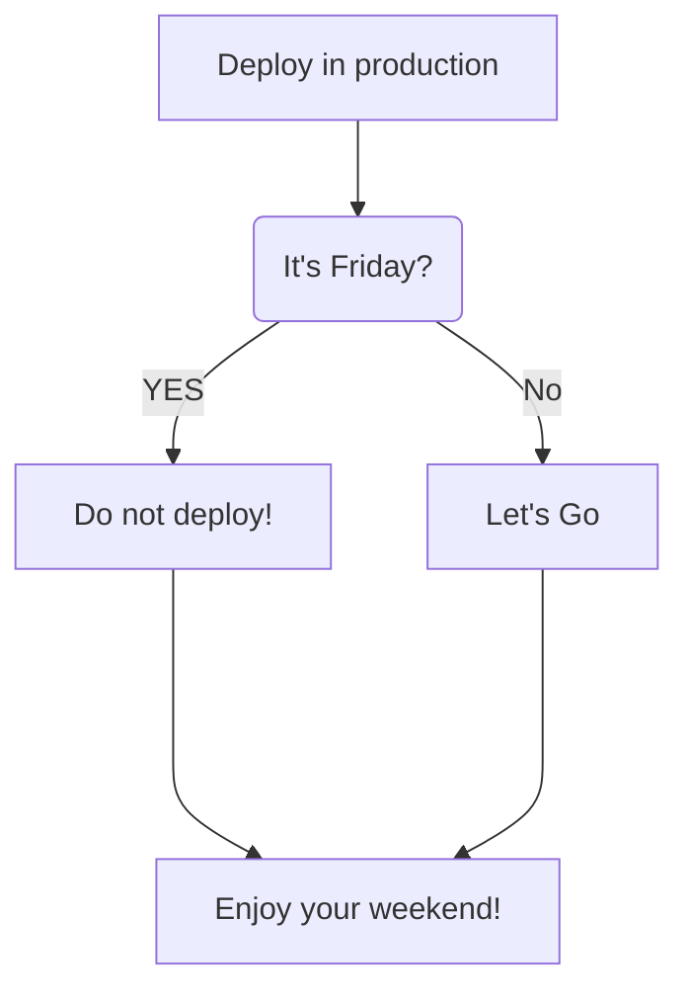

   

	

## Github Stats  
 <!-- 
	

  
  
 

--> 

	
   </a>

	
## Production Life
	

	
### 🛠 Tech Stack 

  
<h2 align="center"> Top Projects </h2>
 
 
<!--	
	-->
  
  
  
  
  
  
  
 

<!--
**Erreur32/Erreur32** is a ✨ _special_ ✨ repository because its `README.md` (this file) appears on your GitHub profile.

Here are some ideas to get you started:

- 🔭 I’m currently working on ...
- 🌱 I’m currently learning ...
- 👯 I’m looking to collaborate on ...
- 🤔 I’m looking for help with ...
- 💬 Ask me about ...
- 📫 How to reach me: ...
- 😄 Pronouns: ...
- ⚡ Fun fact: ...
-->
	

---

<!-- Proudly created with GPRM ( https://gprm.itsvg.in ) -->

 
 https://metrics.lecoq.io/about/Erreur32

